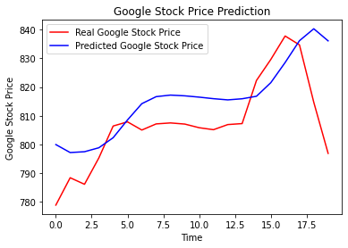

# Google_StockPrice_Prediction

Predicting the Google Stock Price using Recurrent Neural Networks. The Browian Motion states that the future variation of the stock price are independent from the past, so it is actually impossible to predict exactly the future stock price, but it is actually possible to predict some trends. So we're gonna predict the upwards and downwards trends that exist in the Google stock price.

## Visualising the Prediction Graph

